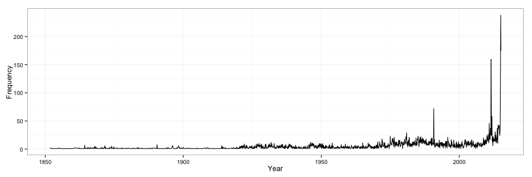

# PPOL 670 Programming Assignment - Scraping

This analysis use data from the [NY Times API](http://developer.nytimes.com/docs/read/article_search_api_v2) to create a monthly time series of coverage of budget deficits issues.

Budget Deficit Coverage in NYTimes (all time)

Budget Deficit Coverage in NYTimes (2000 - current)

In this repo:

-  `nytimes.py` is the Python script to retrive information with NY Times Article Search API v2. 12 key words were used in the query (see details later). Scraped data was inserted into ScraperWiki's data table with SQL queries and downloaded from ScraperWiki. The code is scheduled to run hourly on ScraperWiki while keeping the progress (since ScraperWiki automatically terminate task hourly).  This code was deployed on [ScraperWiki](https://scraperwiki.com/).
-  `nytimes.csv` is the collected information from NY Times Article Search API v2.
-  `visualization.R` is the R script to clean the collected information and visualize it. Duplicated articles were removed based on article id. 
-  `figures` folder contains final graph outputs.

The keywords used in this analysis include:
    budget deficit, compensatory spending, debt, government debt, debt explosion, deficit financing, in the red, megadebt, negative cash flow, no assets, overspending, national debt
